# Werewolf — Actions

Actions are the mechanism by which the Narrator and players mutate game state. Each action has an `isValid` guard and an `apply` mutation.

## Action Reference

### `start-night`

**Who:** Narrator only
**When:** During Daytime
**Effect:** Advances to the next turn and transitions to Nighttime. Builds the `nightPhaseOrder` for the new turn. If the Wolf Cub was killed during the previous night or day, an extra Werewolf phase is appended to `nightPhaseOrder`.

---

### `start-day`

**Who:** Narrator only
**When:** During Nighttime
**Effect:** Resolves all night actions, adds killed players to `deadPlayerIds`, and transitions to Daytime. Stores the `nightResolution` events in the new daytime phase for day-start display. If the Tanner is among the killed players, the game ends immediately with a Tanner win.

Additional resolution steps:

- **Vigilante self-death:** If the Vigilante's target is a Good-team player and was killed, the Vigilante also dies.
- **Hunter revenge detection:** If a killed player is the Hunter, sets `hunterRevengePlayerId` on the Narrator's state and defers the win-condition check until revenge is resolved.

---

### `set-night-phase`

**Who:** Narrator only
**When:** During Nighttime
**Effect:** Advances (or jumps) to the given `phaseIndex` in `nightPhaseOrder`. Resets `startedAt` for the new phase. Used to step through each role's wake turn.

**Payload:** `{ phaseIndex: number }`

---

### `set-night-target`

**Who:** Narrator (explicit `roleId`) or active player (inferred from role)
**When:** During Nighttime, turn 2+
**Effect:** Sets or clears a night target.

- **Solo roles** (Seer, Bodyguard, Witch, etc.): stores `{ targetPlayerId }` under the role's phase key. Passing `targetPlayerId: null` records an intentional skip (`{ skipped: true }`); passing `undefined` clears the selection.
- **Group phases** (Werewolves): upserts the caller's vote in `votes[]`. Passing `null` records a skip vote; passing `undefined` removes the vote. The Narrator override sets all alive participants' votes at once and also sets `suggestedTargetId`.

**Payload:** `{ roleId?: string; targetPlayerId?: string | null }`

**Validation:**

- Turn must be > 1.
- Target must exist, not be dead, not be the game owner.
- Attack/Investigate roles cannot target themselves.
- Group phase players cannot target visible teammates; Narrator cannot target group members.
- Roles with `preventRepeatTarget` (Bodyguard, Spellcaster) cannot target the same player as they targeted the previous night (`lastTargets` in `WerewolfTurnState`).
- In a suffixed repeat group phase (e.g., `"werewolf-werewolf:2"`), the target cannot match the `suggestedTargetId` from the base phase's action (within-night exclusion).
- Cannot change a confirmed target (players only; Narrator can override).

---

### `confirm-night-target`

**Who:** Active player
**When:** During Nighttime, turn 2+
**Effect:** Locks in the player's selected target.

- **Solo phases:** sets `confirmed: true` on the role's night action. Allowed even when no target is set (intentional skip).
- **Group phases:** requires all alive phase participants to have voted for the same target (or all skipped) before confirming. Once confirmed, no player can change their vote.

---

### `reveal-investigation-result`

**Who:** Narrator only
**When:** During Nighttime, active phase is an Investigate role (Seer, Wizard, One-Eyed Seer, Mystic Seer, Mentalist), action is confirmed
**Effect:** Sets `resultRevealed: true` on the night action. This causes the Werewolf player state extraction to include the `investigationResult` in the investigating player's `WerewolfPlayerGameState`.

---

### `mark-player-dead`

**Who:** Narrator only
**When:** Any
**Effect:** Adds the player to `deadPlayerIds`. If the player is the Wolf Cub, sets `wolfCubDied: true` on turn state.

---

### `mark-player-alive`

**Who:** Narrator only
**When:** Any
**Effect:** Removes the player from `deadPlayerIds`.

---

### `start-trial`

**Who:** Narrator only
**When:** During Daytime
**Effect:** Starts a trial against a defendant. Pre-populates forced votes (Village Idiot = guilty, Pacifist = innocent). Clears nominations. Blocked when `concludedTrialsCount >= trialsPerDay` (and `trialsPerDay > 0`).

**Payload:** `{ defendantId: string }`

---

### `cast-vote`

**Who:** Player
**When:** During Daytime (voting phase of an active trial)
**Effect:** Casts a guilty or innocent vote. Silenced and dead players cannot vote. Hypnotized players' votes mirror the Mummy's vote.

**Payload:** `{ vote: "guilty" | "innocent" }`

---

### `resolve-hunter-revenge`

**Who:** Narrator only
**When:** During Daytime, when `hunterRevengePlayerId` is set
**Effect:** Selects the Hunter's revenge target. Kills the target (unblockable), clears `hunterRevengePlayerId`, and checks the win condition.

**Payload:** `{ targetPlayerId: string }`

---

### `resolve-trial`

**Who:** Narrator only
**When:** During Daytime (after voting completes)
**Effect:** Resolves the trial verdict — guilty votes exceeding innocent votes results in elimination. The Mayor's vote counts double. Clears One-Eyed Seer lock and Priest wards for a killed player.

- **Hunter revenge detection:** If the condemned player is the Hunter, sets `hunterRevengePlayerId` on the Narrator's state and defers the win-condition check until revenge is resolved.

---

### `end-game`

**Who:** Narrator only
**When:** Any
**Effect:** Ends the game immediately.

---

### `smite-player`

**Who:** Narrator only
**When:** During Nighttime or Daytime
**Effect:** During nighttime, marks a player for death at start of day (bypasses all protections). During daytime, marks a player to be eliminated at the end of the next night.

**Payload:** `{ playerId: string }`

---

### `unsmite-player`

**Who:** Narrator only
**When:** During Nighttime or Daytime
**Effect:** Removes a pending smite from a player.

**Payload:** `{ playerId: string }`

---

### `nominate-player`

**Who:** Player
**When:** During Daytime
**Effect:** Nominates a defendant for trial. When the nomination count reaches the threshold, a trial is automatically started. Blocked when `concludedTrialsCount >= trialsPerDay` (and `trialsPerDay > 0`).

**Payload:** `{ defendantId: string }`

---

### `withdraw-nomination`

**Who:** Player
**When:** During Daytime
**Effect:** Withdraws the player's own nomination.

---

### `skip-defense`

**Who:** Narrator only
**When:** During Daytime (defense phase of an active trial)
**Effect:** Skips the defense phase and moves the trial directly to voting.

---

### `kill-player`

**Who:** Narrator only
**When:** During Daytime
**Effect:** Immediately kills a player (for in-person trials). Checks win condition. Clears One-Eyed Seer lock and Priest wards for the killed player.

**Payload:** `{ playerId: string }`

---

## Action Payload Summary

| Action                        | Caller                    | Payload                                                |
| ----------------------------- | ------------------------- | ------------------------------------------------------ |
| `start-night`                 | Narrator                  | none                                                   |
| `start-day`                   | Narrator                  | none                                                   |
| `set-night-phase`             | Narrator                  | `{ phaseIndex: number }`                               |
| `set-night-target`            | Narrator or active player | `{ roleId?: string; targetPlayerId?: string \| null }` |
| `confirm-night-target`        | Active player             | none                                                   |
| `reveal-investigation-result` | Narrator                  | none                                                   |
| `mark-player-dead`            | Narrator                  | `{ playerId: string }`                                 |
| `mark-player-alive`           | Narrator                  | `{ playerId: string }`                                 |
| `start-trial`                 | Narrator                  | `{ defendantId: string }`                              |
| `cast-vote`                   | Player                    | `{ vote: "guilty" \| "innocent" }`                     |
| `resolve-hunter-revenge`      | Narrator                  | `{ targetPlayerId: string }`                           |
| `resolve-trial`               | Narrator                  | none                                                   |
| `end-game`                    | Narrator                  | none                                                   |
| `smite-player`                | Narrator                  | `{ playerId: string }`                                 |
| `unsmite-player`              | Narrator                  | `{ playerId: string }`                                 |
| `nominate-player`             | Player                    | `{ defendantId: string }`                              |
| `withdraw-nomination`         | Player                    | none                                                   |
| `skip-defense`                | Narrator                  | none                                                   |
| `kill-player`                 | Narrator                  | `{ playerId: string }`                                 |

## Night Action Types

```typescript
// Solo role action (Seer, Bodyguard, Witch, Spellcaster, Chupacabra, Doctor, Priest, Mummy, Wizard, One-Eyed Seer, Exposer, Mystic Seer, Altruist, Mortician)
interface NightAction {
  targetPlayerId?: string; // absent when skipped
  skipped?: true; // set when the player intentionally chose "Skip"
  confirmed?: boolean;
  resultRevealed?: boolean; // Seer, Wizard, One-Eyed Seer, Mystic Seer
  secondTargetPlayerId?: string; // Mentalist dual-target
}

// Individual vote within a group phase
interface TeamNightVote {
  playerId: string;
  targetPlayerId?: string; // absent when skipped
  skipped?: true; // set when this player intentionally voted "Skip"
}

// Group phase action (Werewolves)
interface TeamNightAction {
  votes: TeamNightVote[];
  suggestedTargetId?: string; // plurality vote target; absent if tie or all skipped
  confirmed?: boolean;
}
```

## Night Resolution

`resolveNightActions()` runs when `start-day` is called:

1. Collects base attacks and protections from all roles except Witch, Altruist, Spellcaster, Mummy, and Swapper.
2. Applies Priest ward protection: any player with an active ward has the ward consume the attack (ward is removed, player survives).
3. Applies Witch action: if target is already under attack → protect; otherwise → attack.
4. Applies Altruist action (last): if the Altruist's target is under attack, the attack is redirected onto the Altruist (the Altruist dies instead).
5. Applies Swapper action: swaps the attacks and protections maps between the two selected players, then builds kill events from the swapped state.
6. Applies Tough Guy absorption: if a Tough Guy is attacked for the first time, the attack is absorbed (survives this night, dies on the next attack).
7. Applies Smite: any smited player is killed regardless of protections.
8. Applies Spellcaster action: emits a `silenced` event.
9. Applies Mummy action: emits a `hypnotized` event for the target.
10. Applies Swapper to silenced and hypnotized events: swaps the `targetPlayerId` of any silenced or hypnotized event between the two Swapper targets, then emits a `swapper-swapped` event.
11. Checks Old Man timer (`oldManTimerPlayerId` option): if the timer has fired **and** the Old Man was not attacked this night, emits a killed event with `attackedBy: [OLD_MAN_TIMER_KEY]`, `died: true`. This bypasses protections (applied after `buildKilledEvents`, like smite). If the Old Man was attacked, the attack takes precedence.
12. Returns `NightResolutionEvent[]`:

- `{ type: "killed", targetPlayerId, attackedBy, protectedBy, died }`
- `{ type: "silenced", targetPlayerId }`
- `{ type: "hypnotized", targetPlayerId }`
- `{ type: "tough-guy-absorbed", targetPlayerId }`
- `{ type: "altruist-intercepted", targetPlayerId }`
- `{ type: "swapper-swapped", firstPlayerId, secondPlayerId }`

After resolution, `start-day` performs additional checks:

- **Mortician ability end**: if the Mortician's target died and was a Werewolf (`isWerewolf`), sets `morticianAbilityEnded: true` on the turn state. The Mortician can no longer target players on subsequent nights.
- **Old Man peaceful death**: The Werewolf player state extraction detects `attackedBy: [OLD_MAN_TIMER_KEY]` and maps it to `DaytimeNightStatusEntry.effect: "peaceful"`, which renders as a special death message for all players.

```mermaid
flowchart TD
    Start([start-day called]) --> Collect[Collect attacks and protections\nfrom Werewolves, Bodyguard, Doctor, Chupacabra]
    Collect --> Priest{Priest ward active\non target?}
    Priest -->|yes| WardAbsorb[Ward absorbs attack\nremove ward]
    Priest -->|no| Witch
    WardAbsorb --> Witch
    Witch{Witch used ability?}
    Witch -->|protect target| Protect[Remove pending attack on target]
    Witch -->|attack target| NewAttack[Add new attack on target]
    Witch -->|skipped| Altruist
    Protect --> Altruist
    NewAttack --> Altruist
    Altruist{Altruist target\nunder attack?}
    Altruist -->|yes| Intercept[Redirect attack onto Altruist\nemit altruist-intercepted]
    Altruist -->|no| Swapper
    Intercept --> Swapper
    Swapper{Swapper acted?}
    Swapper -->|yes| SwapAP[Swap attacks and protections\nbetween selected players]
    Swapper -->|no| ToughGuy
    SwapAP --> ToughGuy
    ToughGuy{Tough Guy attacked\nfor first time?}
    ToughGuy -->|yes| Absorb[Absorb attack\nemit tough-guy-absorbed]
    ToughGuy -->|no| Smite
    Absorb --> Smite
    Smite{Player smited?}
    Smite -->|yes| ForceDeath[Force death regardless\nof protections]
    Smite -->|no| Spellcaster
    ForceDeath --> Spellcaster
    Spellcaster{Spellcaster acted?}
    Spellcaster -->|yes| Silence[Emit silenced event for target]
    Spellcaster -->|no| Mummy
    Silence --> Mummy
    Mummy{Mummy acted?}
    Mummy -->|yes| Hypnotize[Emit hypnotized event for target]
    Mummy -->|no| SwapEffects
    Hypnotize --> SwapEffects
    SwapEffects{Swapper acted?}
    SwapEffects -->|yes| SwapSH[Swap silenced and hypnotized\nevents between selected players\nemit swapper-swapped]
    SwapEffects -->|no| Resolve
    SwapSH --> Resolve
    Resolve[For each collected attack:\nif protected → died = false\nelse → died = true\nemit killed event]
    Resolve --> OldMan{Old Man timer expired\nand not attacked?}
    OldMan -->|yes| Peaceful[Emit killed event\nattackedBy: OLD_MAN_TIMER_KEY\ndied: true]
    OldMan -->|no| Return
    Peaceful --> Return
    Return([Return NightResolutionEvent array])
```



## Trial Resolution

When a player is voted out at trial (via `mark-player-dead` during Daytime), the following checks run in order:

1. **Tanner check:** If the killed player is the Tanner, the game ends immediately with a Tanner win.
2. **Executioner target check:** If the killed player is the Executioner's assigned target, the Executioner wins. (The Executioner win is independent of the overall game outcome — the game may continue.)

## Win Condition Logic

Win conditions are evaluated after each death (night resolution or trial). The checks run in the following priority order:

1. **Tanner instant win** — If the Tanner dies (at night or at trial), the game ends immediately with a Tanner win.
2. **Lone Wolf check** (before general wolf win) — When wolves would win (all Good-team players eliminated), if the Lone Wolf is the only surviving wolf-aligned player, the Lone Wolf wins instead of Team Bad.
3. **Standard team win** — Good wins if all Bad-team players are dead. Bad wins if wolves equal or outnumber Good-team players.
4. **Spoiler override** (after team win determined) — If a standard team win is detected and the Spoiler is still alive, the Spoiler wins instead of the winning team.
5. **Executioner win** — Evaluated independently at trial: if the Executioner's assigned target is voted out, the Executioner wins regardless of overall game state.
