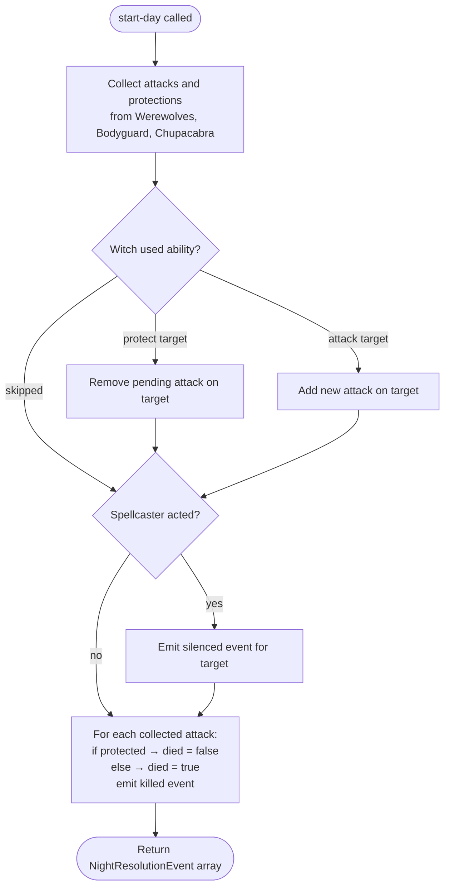

# Werewolf — Actions

Actions are the mechanism by which the Narrator and players mutate game state. Each action has an `isValid` guard and an `apply` mutation.

## Action Reference

### `start-night`

**Who:** Narrator only
**When:** During Daytime
**Effect:** Advances to the next turn and transitions to Nighttime. Builds the `nightPhaseOrder` for the new turn. If the Wolf Cub was killed during the previous night or day, an extra Werewolf phase is appended to `nightPhaseOrder`.

---

### `start-day`

**Who:** Narrator only
**When:** During Nighttime
**Effect:** Resolves all night actions, adds killed players to `deadPlayerIds`, and transitions to Daytime. Stores the `nightResolution` events in the new daytime phase for day-start display.

---

### `set-night-phase`

**Who:** Narrator only
**When:** During Nighttime
**Effect:** Advances (or jumps) to the given `phaseIndex` in `nightPhaseOrder`. Resets `startedAt` for the new phase. Used to step through each role's wake turn.

**Payload:** `{ phaseIndex: number }`

---

### `set-night-target`

**Who:** Narrator (explicit `roleId`) or active player (inferred from role)
**When:** During Nighttime, turn 2+
**Effect:** Sets or clears a night target.

- **Solo roles** (Seer, Bodyguard, Witch, etc.): stores `{ targetPlayerId }` under the role's phase key. Passing `targetPlayerId: null` records an intentional skip (`{ skipped: true }`); passing `undefined` clears the selection.
- **Group phases** (Werewolves): upserts the caller's vote in `votes[]`. Passing `null` records a skip vote; passing `undefined` removes the vote. The Narrator override sets all alive participants' votes at once and also sets `suggestedTargetId`.

**Payload:** `{ roleId?: string; targetPlayerId?: string | null }`

**Validation:**

- Turn must be > 1.
- Target must exist, not be dead, not be the game owner.
- Attack/Investigate roles cannot target themselves.
- Group phase players cannot target visible teammates; Narrator cannot target group members.
- Roles with `preventRepeatTarget` (Bodyguard, Spellcaster) cannot target the same player as they targeted the previous night (`lastTargets` in `WerewolfTurnState`).
- In a suffixed repeat group phase (e.g., `"werewolf-werewolf:2"`), the target cannot match the `suggestedTargetId` from the base phase's action (within-night exclusion).
- Cannot change a confirmed target (players only; Narrator can override).

---

### `confirm-night-target`

**Who:** Active player
**When:** During Nighttime, turn 2+
**Effect:** Locks in the player's selected target.

- **Solo phases:** sets `confirmed: true` on the role's night action. Allowed even when no target is set (intentional skip).
- **Group phases:** requires all alive phase participants to have voted for the same target (or all skipped) before confirming. Once confirmed, no player can change their vote.

---

### `reveal-investigation-result`

**Who:** Narrator only
**When:** During Nighttime, active phase is an Investigate role (Seer), action is confirmed
**Effect:** Sets `resultRevealed: true` on the night action. This causes `GameSerializationService` to include the `investigationResult` in the Seer's `PlayerGameState`.

---

### `mark-player-dead`

**Who:** Narrator only
**When:** Any
**Effect:** Adds the player to `deadPlayerIds`. If the player is the Wolf Cub, sets `wolfCubDied: true` on turn state.

---

### `mark-player-alive`

**Who:** Narrator only
**When:** Any
**Effect:** Removes the player from `deadPlayerIds`.

---

## Action Payload Summary

| Action                        | Caller                    | Payload                                                |
| ----------------------------- | ------------------------- | ------------------------------------------------------ |
| `start-night`                 | Narrator                  | none                                                   |
| `start-day`                   | Narrator                  | none                                                   |
| `set-night-phase`             | Narrator                  | `{ phaseIndex: number }`                               |
| `set-night-target`            | Narrator or active player | `{ roleId?: string; targetPlayerId?: string \| null }` |
| `confirm-night-target`        | Active player             | none                                                   |
| `reveal-investigation-result` | Narrator                  | none                                                   |
| `mark-player-dead`            | Narrator                  | `{ playerId: string }`                                 |
| `mark-player-alive`           | Narrator                  | `{ playerId: string }`                                 |

## Night Action Types

```typescript
// Solo role action (Seer, Bodyguard, Witch, Spellcaster, Chupacabra)
interface NightAction {
  targetPlayerId?: string; // absent when skipped
  skipped?: true; // set when the player intentionally chose "Skip"
  confirmed?: boolean;
  resultRevealed?: boolean; // Seer only
}

// Individual vote within a group phase
interface TeamNightVote {
  playerId: string;
  targetPlayerId?: string; // absent when skipped
  skipped?: true; // set when this player intentionally voted "Skip"
}

// Group phase action (Werewolves)
interface TeamNightAction {
  votes: TeamNightVote[];
  suggestedTargetId?: string; // plurality vote target; absent if tie or all skipped
  confirmed?: boolean;
}
```

## Night Resolution

`resolveNightActions()` runs when `start-day` is called:

1. Collects base attacks and protections from all roles except Witch and Spellcaster.
2. Applies Witch action: if target is already under attack → protect; otherwise → attack.
3. Applies Spellcaster action: emits a `silenced` event.
4. Returns `NightResolutionEvent[]`:
   - `{ type: "killed", targetPlayerId, attackedBy, protectedBy, died }`
   - `{ type: "silenced", targetPlayerId }`


