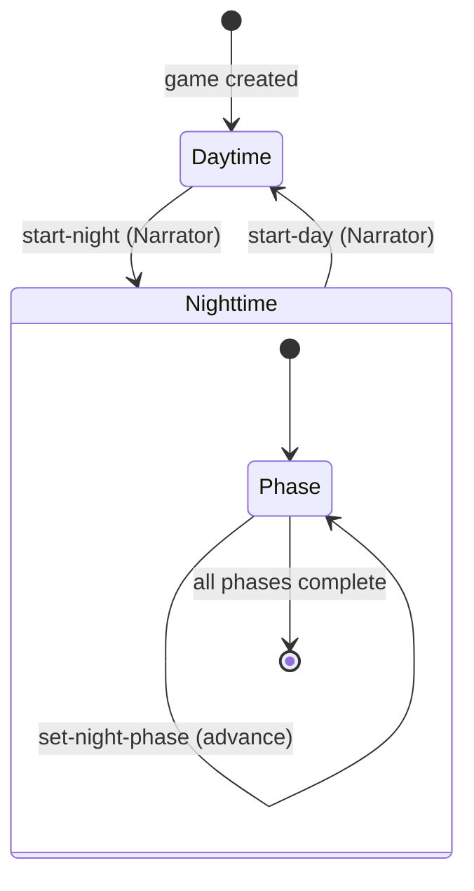
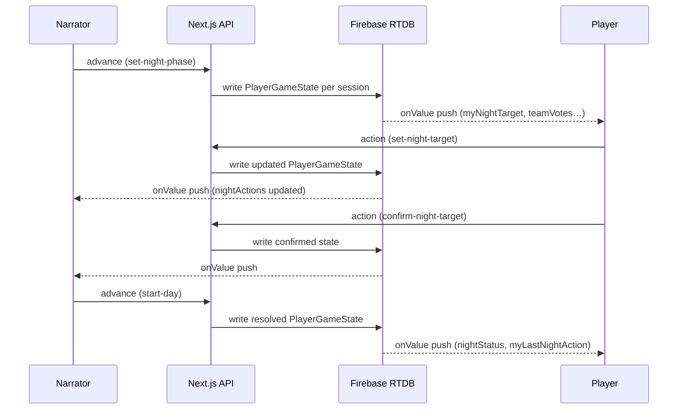

# Werewolf — Data Flow

## Overview

Game state lives in Firebase Realtime Database and is pre-computed per player by `GameSerializationService`. Each player receives only the information appropriate for their role and the current phase.

## Database Layout

```
/games/{gameId}/public            — game metadata
/games/{gameId}/playerState/{sessionId}   — pre-computed PlayerGameState per player
/games/{gameId}/sessionIndex/{sessionId} — maps sessionId → playerId
```

The Narrator's session is stored separately and receives a different (fuller) `PlayerGameState` than regular players.

## PlayerGameState Fields

### Always Present

| Field                    | Narrator        | Players                         |
| ------------------------ | --------------- | ------------------------------- |
| `status`                 | ✓               | ✓                               |
| `gameMode`               | ✓               | ✓                               |
| `players`                | ✓               | ✓                               |
| `gameOwner`              | ✓               | ✓                               |
| `myPlayerId`             | — (undefined)   | ✓                               |
| `myRole`                 | — (undefined)   | ✓ own role                      |
| `visibleRoleAssignments` | All assignments | Teammates + dead players' roles |
| `rolesInPlay`            | ✓               | ✓                               |
| `deadPlayerIds`          | ✓               | ✓                               |
| `timerConfig`            | ✓ (if set)      | ✓ (if set)                      |

### Narrator-Only (Nighttime)

| Field          | Description                                         |
| -------------- | --------------------------------------------------- |
| `nightActions` | Full record of all night actions keyed by phase key |

### Player Fields — Nighttime (own turn only)

These fields are only populated when the active phase matches the player's role.

| Field                    | Roles                                           | Description                                                                                                                                                                               |
| ------------------------ | ----------------------------------------------- | ----------------------------------------------------------------------------------------------------------------------------------------------------------------------------------------- |
| `myNightTarget`          | All night-waking roles                          | Selected target player ID (`string`), intentional skip (`null`), or undecided (`undefined`)                                                                                               |
| `myNightTargetConfirmed` | All night-waking roles                          | Whether the selection is locked in                                                                                                                                                        |
| `teamVotes`              | Werewolf (group phase)                          | `({ playerName, targetPlayerId } \| { playerName, skipped: true })[]` — all alive group members' current votes                                                                            |
| `suggestedTargetId`      | Werewolf (group phase)                          | The plurality vote target (undefined if tie or all skipped)                                                                                                                               |
| `allAgreed`              | Werewolf (group phase)                          | `true` when all alive members have voted for the same target or all have skipped                                                                                                          |
| `investigationResult`    | Seer                                            | `{ targetPlayerId, isWerewolfTeam }` — only after Narrator calls `reveal-investigation-result`                                                                                            |
| `witchAbilityUsed`       | Witch                                           | `false` when ability is available; `true` once used                                                                                                                                       |
| `nightStatus`            | Witch (ability available)                       | `{ targetPlayerId, effect: "attacked" }[]` — players currently under attack this night                                                                                                    |
| `previousNightTargetId`  | Bodyguard, Spellcaster; Werewolf (second phase) | Player ID unavailable this turn: previous night's target for `preventRepeatTarget` roles; first phase's `suggestedTargetId` for the second Werewolf attack phase (within-night exclusion) |

### Player Fields — Daytime (day start)

| Field         | Description                                                                            |
| ------------- | -------------------------------------------------------------------------------------- |
| `nightStatus` | `{ targetPlayerId, effect: "killed" \| "silenced" }[]` — outcome of the previous night |

## Game Phase State Machine



## Data Flow Per Phase

### Lobby → Game Start

1. Narrator calls the lobby API to start the game.
2. `GameInitializationService` creates the game record and assigns roles.
3. Firebase writes initial `PlayerGameState` for each session.
4. Clients receive real-time updates via Firebase `onValue`.

### Night Phase



```
Narrator advances phase (set-night-phase)
  → nightPhaseOrder[currentPhaseIndex] becomes the active phase key
  → Players with that role/wakesWith receive myNightTarget, teamVotes, etc.

Player sets target (set-night-target)
  → nightActions[phaseKey] updated in Firebase
  → All players in that phase receive updated teamVotes/suggestedTargetId

Player confirms (confirm-night-target)
  → nightActions[phaseKey].confirmed = true
  → myNightTargetConfirmed becomes true for the player

Narrator reveals investigation (reveal-investigation-result)
  → nightActions[phaseKey].resultRevealed = true
  → Seer's PlayerGameState gains investigationResult

Narrator starts day (start-day)
  → resolveNightActions() runs
  → Killed players added to deadPlayerIds
  → nightResolution stored in daytime phase
  → PlayerGameState rebuilt: nightStatus and myLastNightAction populated
```

### Day Phase

```
Players discuss and vote (outside the app)
Narrator marks players dead (mark-player-dead / mark-player-alive)
  → deadPlayerIds updated
  → Dead player's role revealed in visibleRoleAssignments for all

Narrator starts next night (start-night)
  → New turn begins; nightPhaseOrder rebuilt
  → Night fields (myNightTarget, teamVotes, etc.) cleared for all players
```

## Role Visibility Details

`visibleRoleAssignments` is built per-player from:

1. **Own teammates** — players whose role matches a `canSeeTeam` entry.
   - Werewolves see all Team Bad players.
   - Masons see all other Masons.
2. **Dead players** — roles of all dead players are revealed to everyone.
3. **Narrator** — sees all role assignments always.

Players never see their own role in `visibleRoleAssignments` (their role is in `myRole`).

## Night Actions Key Format

Night actions are stored in a `Record<phaseKey, AnyNightAction>`:

| Role type                           | Phase key                                  | Action type       |
| ----------------------------------- | ------------------------------------------ | ----------------- |
| Solo (Seer, Bodyguard, Witch, etc.) | Role ID — e.g., `"werewolf-seer"`          | `NightAction`     |
| Group (Werewolves)                  | Primary role ID — `"werewolf-werewolf"`    | `TeamNightAction` |
| Repeated group phase                | Suffixed role ID — `"werewolf-werewolf:2"` | `TeamNightAction` |

Secondary roles with `wakesWith` (e.g., Wolf Cub) participate in the primary role's `TeamNightAction` and share the same phase key; they do not have their own key.

When a group phase is repeated (e.g., Wolf Cub double-phase), each repetition uses a suffixed key (`<roleId>:<n>`). `baseGroupPhaseKey()` strips the suffix to look up the role definition. The within-night exclusion prevents the second phase from targeting the same player as the `suggestedTargetId` from the first phase.

## Witch Special Case

The Witch sees `nightStatus` with `effect: "attacked"` entries **only** when her ability has not yet been used (`witchAbilityUsed: false`). This shows the current night's attacks from all other roles (Werewolves, Chupacabra), computed from `nightActions` before the Witch acts. Once the Witch uses her ability or if `witchAbilityUsed: true`, `nightStatus` is omitted from her state.

## Wolf Cub Special Case

When the Wolf Cub is killed (via `start-day` resolution or `mark-player-dead`), `wolfCubDied: true` is set on `WerewolfTurnState`. The next time `start-night` is called, an extra Werewolf group phase with key `"werewolf-werewolf:2"` is appended to `nightPhaseOrder`, giving Werewolves two separate attack phases that night.

The second phase cannot target the same player that was the `suggestedTargetId` of the first phase (within-night exclusion). This is distinct from the cross-night `preventRepeatTarget` mechanism used by Bodyguard and Spellcaster, which prevents targeting the same player on consecutive nights (tracked via `lastTargets` in `WerewolfTurnState`).

The `wolfCubDied` flag is cleared when `start-night` consumes it to generate the bonus phase.
