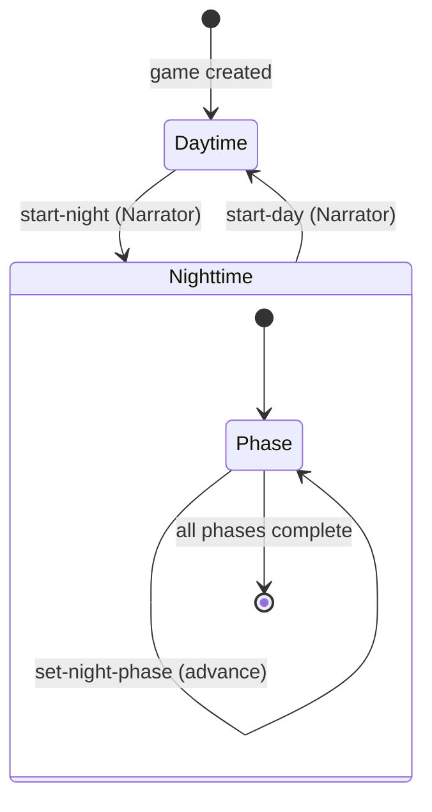
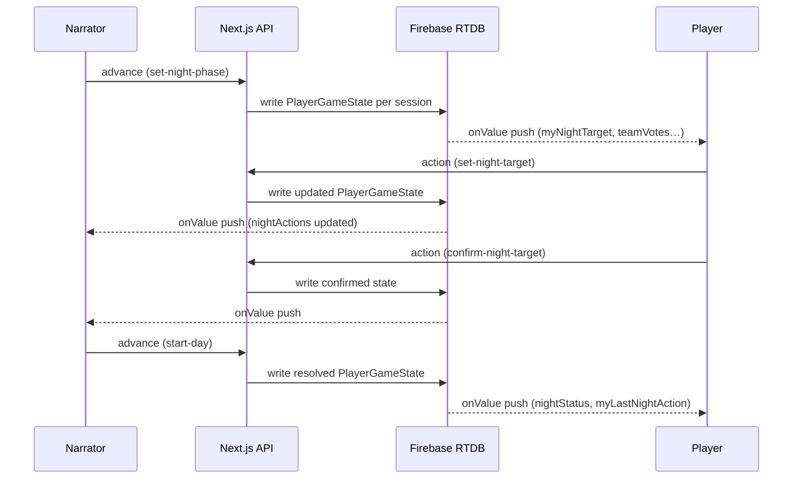

# Werewolf — Data Flow

## Overview

Game state lives in Firebase Realtime Database and is pre-computed per player by `getPlayerGameState` (`src/lib/game-state.ts`). Each player receives only the information appropriate for their role and the current phase.

## Database Layout

```
/games/{gameId}/public            — game metadata
/games/{gameId}/playerState/{sessionId}   — pre-computed PlayerGameState per player
/games/{gameId}/sessionIndex/{sessionId} — maps sessionId → playerId
```

The Narrator's session is stored separately and receives a different (fuller) `PlayerGameState` than regular players.

## PlayerGameState Fields

### Always Present (base PlayerGameState)

| Field                    | Narrator        | Players                         |
| ------------------------ | --------------- | ------------------------------- |
| `status`                 | ✓               | ✓                               |
| `gameMode`               | ✓               | ✓                               |
| `players`                | ✓               | ✓                               |
| `gameOwner`              | ✓               | ✓                               |
| `myPlayerId`             | — (undefined)   | ✓                               |
| `myRole`                 | — (undefined)   | ✓ own role                      |
| `visibleRoleAssignments` | All assignments | Teammates + dead players' roles |
| `rolesInPlay`            | ✓               | ✓                               |
| `deadPlayerIds`          | ✓               | ✓                               |
| `timerConfig`            | ✓ (if set)      | ✓ (if set)                      |
| `victoryCondition`       | ✓ (if finished) | ✓ (if finished)                 |

`victoryCondition` is only present when `status.type === "Finished"`. It contains a human-readable `label` (e.g. `"By elimination"`) and a `winner: Team` used for colour/icon selection. The label is derived from the `winner` field and is sourced from `WEREWOLF_COPY.gameOver.victoryConditions`.

### Werewolf Game Settings (WerewolfPlayerGameState)

| Field                    | Narrator | Players | Description                                                              |
| ------------------------ | -------- | ------- | ------------------------------------------------------------------------ |
| `nominationsEnabled`     | ✓        | ✓       | Whether player nominations for trial are enabled                         |
| `trialsPerDay`           | ✓        | ✓       | Max number of trials allowed per day (0 = unlimited)                     |
| `concludedTrialsCount`   | ✓        | ✓       | Number of trials concluded so far this day phase                         |
| `revealProtections`      | ✓        | ✓       | Whether night summary reveals protection saves                           |
| `hiddenRoleCount`        | ✓        | ✓       | Number of roles drawn but not assigned at game start                     |
| `autoRevealNightOutcome` | ✓        | ✓       | Whether kills/silences are revealed to everyone immediately at day start |

### Narrator-Only (Nighttime)

| Field                      | Description                                                                                                                                        |
| -------------------------- | -------------------------------------------------------------------------------------------------------------------------------------------------- |
| `nightActions`             | Full record of all night actions keyed by phase key                                                                                                |
| `hunterRevengePlayerId`    | Player ID of the Hunter awaiting revenge resolution; set when Hunter dies                                                                          |
| `monarchKnightedPlayerIds` | Public list of player IDs currently marked as Knighted by the Monarch                                                                              |
| `monarchKnightingsUsed`    | Number of Monarch knightings already used (max 3)                                                                                                  |
| `hiddenRoleIds`            | Role IDs drawn from the pool but not assigned to any player; stored in `FirebaseWerewolfPlayerState` (session-scoped, not in `FirebaseGamePublic`) |

### Player Fields — Nighttime (own turn only)

These fields are only populated when the active phase matches the player's role.

| Field                       | Roles                                               | Description                                                                                                                                                                               |
| --------------------------- | --------------------------------------------------- | ----------------------------------------------------------------------------------------------------------------------------------------------------------------------------------------- |
| `myNightTarget`             | All night-waking roles                              | Selected target player ID (`string`), intentional skip (`null`), or undecided (`undefined`)                                                                                               |
| `myNightTargetConfirmed`    | All night-waking roles                              | Whether the selection is locked in                                                                                                                                                        |
| `teamVotes`                 | Werewolf (group phase)                              | `({ playerName, targetPlayerId } \| { playerName, skipped: true })[]` — all alive group members' current votes                                                                            |
| `suggestedTargetId`         | Werewolf (group phase)                              | The plurality vote target (undefined if tie or all skipped)                                                                                                                               |
| `allAgreed`                 | Werewolf (group phase)                              | `true` when all alive members have voted for the same target or all have skipped                                                                                                          |
| `investigationResult`       | Seer, Wizard, One-Eyed Seer, Mystic Seer, Mentalist | `{ targetPlayerId, isWerewolfTeam }` (or exact role for Mystic Seer, or same-team result for Mentalist) — only after Narrator calls `reveal-investigation-result`                         |
| `witchAbilityUsed`          | Witch                                               | `false` when ability is available; `true` once used                                                                                                                                       |
| `nightStatus`               | Witch (ability available)                           | `{ targetPlayerId, effect: "attacked" }[]` — players currently under attack this night                                                                                                    |
| `previousNightTargetId`     | Bodyguard, Spellcaster; Werewolf (second phase)     | Player ID unavailable this turn: previous night's target for `preventRepeatTarget` roles; first phase's `suggestedTargetId` for the second Werewolf attack phase (within-night exclusion) |
| `priestWardActive`          | Priest                                              | Whether the Priest's ward is currently active on a player                                                                                                                                 |
| `mySecondNightTarget`       | Mentalist                                           | The Mentalist's second target for dual-target investigation                                                                                                                               |
| `elusiveSeerVillagerIds`    | Elusive Seer                                        | List of player IDs who have the Villager role (shown on first night only)                                                                                                                 |
| `oneEyedSeerLockedTargetId` | One-Eyed Seer                                       | Player ID the One-Eyed Seer is locked onto after detecting a werewolf                                                                                                                     |
| `executionerTargetId`       | Executioner                                         | The player ID of the Executioner's assigned Good-team target; visible only to the Executioner                                                                                             |
| `monarchKnightedPlayerIds`  | All players                                         | Public list of knighted players                                                                                                                                                           |
| `monarchKnightingsUsed`     | All players                                         | Number of knightings used by the Monarch (0-3)                                                                                                                                            |
| `arsonistDousedPlayerIds`   | Arsonist                                            | List of player IDs currently doused by the Arsonist; shown to the Arsonist at night. Reset after an ignite (self-target).                                                                 |

### Player Fields — Daytime (day start)

| Field                      | Description                                                                                                                                                                                                                                                                                                                                                                                                                                                                                                                                                               |
| -------------------------- | ------------------------------------------------------------------------------------------------------------------------------------------------------------------------------------------------------------------------------------------------------------------------------------------------------------------------------------------------------------------------------------------------------------------------------------------------------------------------------------------------------------------------------------------------------------------------- |
| `nightStatus`              | `{ targetPlayerId, effect }[]` — outcome of the previous night. Effects: `"killed"`, `"knighted"`, `"silenced"`, `"hypnotized"`, `"smited"`, `"survived"`, `"peaceful"`, `"altruist-sacrifice"`, `"exposed"`, `"veteran-counterkill"` (`"peaceful"` indicates the Old Man died from timer expiring; `"altruist-sacrifice"` entries also carry a `savedPlayerId` field with the player who was saved; `"exposed"` entries also carry a `roleName` field containing the revealed role name; `"veteran-counterkill"` indicates the player was counter-killed by the Veteran) |
| `nominations`              | Current nominations for trial defendants                                                                                                                                                                                                                                                                                                                                                                                                                                                                                                                                  |
| `myNominatedDefendantId`   | The defendant this player has nominated (if any)                                                                                                                                                                                                                                                                                                                                                                                                                                                                                                                          |
| `activeTrial`              | Active trial state (defendant, phase, votes) if a trial is in progress                                                                                                                                                                                                                                                                                                                                                                                                                                                                                                    |
| `isSilenced`               | Whether this player is silenced (cannot vote or nominate)                                                                                                                                                                                                                                                                                                                                                                                                                                                                                                                 |
| `isHypnotized`             | Whether this player is hypnotized (vote mirrors the Mummy)                                                                                                                                                                                                                                                                                                                                                                                                                                                                                                                |
| `exposerReveal`            | Publicly revealed role from the Exposer's ability (if any)                                                                                                                                                                                                                                                                                                                                                                                                                                                                                                                |
| `monarchKnightedPlayerIds` | Public list of players knighted by the Monarch                                                                                                                                                                                                                                                                                                                                                                                                                                                                                                                            |
| `altruistSave`             | Information about an Altruist intercept that saved a player                                                                                                                                                                                                                                                                                                                                                                                                                                                                                                               |

## Game Phase State Machine



## Data Flow Per Phase

### Lobby → Game Start

1. Narrator calls the lobby API to start the game.
2. `createGame` (`src/server/game.ts`) orchestrates game creation: `buildGame` assembles the `Game` object (role assignment, player visibility), `saveGame` persists it to Firebase.
   - If `hiddenRoleCount > 0`, `assignRolesFromBucketsWithHidden` draws `players + hiddenRoleCount` roles, randomly sets aside the hidden ones (ensuring at least one Bad/Neutral role remains in play), and stores them in `game.hiddenRoleIds`.
   - `hiddenRoleIds` is written only to the Narrator's session-scoped `FirebaseWerewolfPlayerState`; it is never included in `FirebaseGamePublic`.
3. `buildAllPlayerStates` computes per-player `PlayerGameState` for each session; `writeAllPlayerStates` writes them to Firebase.
4. Clients receive real-time updates via Firebase `onValue`.

Monarch-specific flow: when `start-day` resolves night actions, any confirmed Monarch target is added to `monarchKnightedPlayerIds` and `monarchKnightingsUsed` is incremented (capped at 3). In the same pass, Monarch auto-protection is evaluated against attackers and living Knighted players.

### Night Phase



```
Narrator advances phase (set-night-phase)
  → nightPhaseOrder[currentPhaseIndex] becomes the active phase key
  → Players with that role/wakesWith receive myNightTarget, teamVotes, etc.

Player sets target (set-night-target)
  → nightActions[phaseKey] updated in Firebase
  → All players in that phase receive updated teamVotes/suggestedTargetId

Player confirms (confirm-night-target)
  → nightActions[phaseKey].confirmed = true
  → myNightTargetConfirmed becomes true for the player

Narrator reveals investigation (reveal-investigation-result)
  → nightActions[phaseKey].resultRevealed = true
  → Investigator's PlayerGameState gains investigationResult (Seer, Wizard, One-Eyed Seer, Mystic Seer, Mentalist)

Narrator starts day (start-day)
  → resolveNightActions() runs:
    1. Collect attacks/protections (Werewolves, Bodyguard, Doctor, Chupacabra)
    2. Apply Arsonist ignite (if self-targeted: attack each doused player independently)
    3. Apply Priest wards (ward absorbs attack, ward is consumed)
    4. Apply Witch action (protect or attack)
    5. Apply Altruist intercept (redirects attack onto self)
    6. Apply Veteran counter-kill (after Altruist, so Altruist cannot intercept the counter-kill):
       - Wolf repel: wolf attack on alerted Veteran removed, one wolf counter-killed
       - Visitor kill: Protect/Attack roles and Mirrorcaster that physically visited the Veteran are counter-killed
    7. Apply Smite (forced death regardless of protections)
    8. Check Old Man timer
    9. Apply Tough Guy absorption (survives first attack; Smite and Old Man timer deaths are forced and bypass this)
   10. Emit veteran-counterkilled events (after Tough Guy absorption, so died reflects actual outcome)
   11. Apply Spellcaster silence and Mummy hypnotize
   12. Resolve remaining attacks (protected → survived, else → killed)
  → Arsonist doused list updated:
    - Self-target (ignite): list reset to empty after attacks resolved
    - Other-target (douse): target appended to arsonistDousedPlayerIds (dead targets skipped)
    - Dead players removed from doused list
  → Killed players added to deadPlayerIds
  → nightResolution stored in daytime phase
  → PlayerGameState rebuilt: nightStatus and myLastNightAction populated
```

### Day Phase

```
Players discuss and may nominate defendants (nominate-player / withdraw-nomination)
  → nominations updated for all players
  → When nomination threshold is reached, trial starts automatically

Trial flow (if nominations are enabled):
  1. Nominations → threshold reached or Narrator calls start-trial
  2. Defense phase → defendant speaks (Narrator may skip-defense)
  3. Voting phase → players cast-vote (guilty/innocent)
     - Village Idiot votes are forced guilty
     - Pacifist votes are forced innocent
     - Hypnotized votes mirror the Mummy
     - Silenced/dead players cannot vote
     - Mayor's vote counts double
  4. Narrator calls resolve-trial → guilty > innocent = eliminated
     - Clears OES lock and Priest wards for killed player

Narrator may also:
  - kill-player → immediately kills a player (for in-person trials)
  - mark-player-dead / mark-player-alive → manual dead state management
    → deadPlayerIds updated
    → Dead player's role revealed in visibleRoleAssignments for all

Narrator starts next night (start-night)
  → New turn begins; nightPhaseOrder rebuilt
  → Night fields (myNightTarget, teamVotes, etc.) cleared for all players
```

## Role Visibility Details

`visibleRoleAssignments` is built per-player from:

1. **Wake-phase partners** — roles sharing a group night phase via `teamTargeting` or `wakesWith`.
   - Werewolves see other Werewolves, Wolf Cubs, and Lone Wolves (shared group phase).
   - Wolf Cubs and Lone Wolves see all Werewolf wake-phase participants.
2. **Aware-of** — explicit one-directional awareness via the `awareOf` property.
   - Lone Wolf sees all `isWerewolf` players (`awareOf: { werewolves: true }`).
   - Masons see all other Masons (`awareOf: { roles: [Mason] }`).
   - Minion sees all `isWerewolf` players (`awareOf: { werewolves: true }`). Werewolves do NOT see the Minion.
   - Sentinel sees the Seer (`awareOf: { roles: [Seer] }`).
3. **Dead players** — roles of all dead players are revealed to everyone.
4. **Narrator** — sees all role assignments always.

Players never see their own role in `visibleRoleAssignments` (their role is in `myRole`).

## Night Actions Key Format

Night actions are stored in a `Record<phaseKey, AnyNightAction>`:

| Role type                           | Phase key                                  | Action type       |
| ----------------------------------- | ------------------------------------------ | ----------------- |
| Solo (Seer, Bodyguard, Witch, etc.) | Role ID — e.g., `"werewolf-seer"`          | `NightAction`     |
| Group (Werewolves)                  | Primary role ID — `"werewolf-werewolf"`    | `TeamNightAction` |
| Repeated group phase                | Suffixed role ID — `"werewolf-werewolf:2"` | `TeamNightAction` |

Secondary roles with `wakesWith` (e.g., Wolf Cub) participate in the primary role's `TeamNightAction` and share the same phase key; they do not have their own key.

When a group phase is repeated (e.g., Wolf Cub double-phase), each repetition uses a suffixed key (`<roleId>:<n>`). `baseGroupPhaseKey()` strips the suffix to look up the role definition. The within-night exclusion prevents the second phase from targeting the same player as the `suggestedTargetId` from the first phase.

## Witch Special Case

The Witch sees `nightStatus` with `effect: "attacked"` entries **only** when her ability has not yet been used (`witchAbilityUsed: false`). This shows the current night's attacks from all other roles (Werewolves, Chupacabra), computed from `nightActions` before the Witch acts. Once the Witch uses her ability or if `witchAbilityUsed: true`, `nightStatus` is omitted from her state.

## Wolf Cub Special Case

When the Wolf Cub is killed (via `start-day` resolution or `mark-player-dead`), `roleState.wolfCub.died: true` is set on `WerewolfTurnState`. The next time `start-night` is called, an extra Werewolf group phase with key `"werewolf-werewolf:2"` is appended to `nightPhaseOrder`, giving Werewolves two separate attack phases that night.

The second phase cannot target the same player that was the `suggestedTargetId` of the first phase (within-night exclusion). This is distinct from the cross-night `preventRepeatTarget` mechanism used by Bodyguard and Spellcaster, which prevents targeting the same player on consecutive nights (tracked via `lastTargets` in `WerewolfTurnState`).

The `roleState.wolfCub.died` flag is cleared when `start-night` consumes it to generate the bonus phase.

## Old Man Timer

When the Old Man role is in play, `start-day` checks whether the Old Man's timer has fired. The timer fires on turn `#werewolves + 2` (where `#werewolves` counts all roles with `isWerewolf`, including Wolf Cub). If the Old Man is still alive and was **not** attacked that same night, they die peacefully — the resolution emits a kill event with `attackedBy: [OLD_MAN_TIMER_KEY]`. If the Old Man was attacked and killed by wolves (or any other attacker), the attack takes precedence and no timer event is emitted.

## Narrator Night Instructions

`buildNarratorInstruction` (`src/lib/game/modes/werewolf/utils/narrator-instructions.ts`) produces a
`NarratorInstruction` for the narrator's UI during Night 1. The instruction is shown by the
`NarratorNightInstruction` component and contains three optional fields:

| Field             | Description                                                                        |
| ----------------- | ---------------------------------------------------------------------------------- |
| `preWake`         | Script line spoken before waking a role (e.g. Werewolf thumb cue for Minion phase) |
| `wakeInstruction` | Always-present line telling the role(s) to open their eyes                         |
| `postWake`        | Script line spoken after the role is awake (e.g. action reminder)                  |

The function accepts a `phaseKey` (which may be a suffixed group-phase key such as
`"werewolf-werewolf:2"`) and a set of active role IDs. It normalises suffixed group-phase keys via
`baseGroupPhaseKey()` before looking up the role definition.

Per-role script logic:

- **Minion** — `preWake` tells all Werewolves to raise their thumbs. When extra werewolf-aligned
  roles (e.g. Wolf Cub, Lone Wolf) are in play, their names are interpolated:
  `"All Werewolves, including Wolf Cub, raise your thumbs."`
- **Sentinel** — `preWake` tells the Seer to raise their thumb only when the Seer is active.
- **Mason** — `wakeInstruction` uses the plural form; `postWake` asks them to find each other.
- **Group-phase roles** (`teamTargeting: true`, e.g. Werewolves) — plural `wakeInstruction` with
  target-selection reminder.
- **Solo roles with night activity** (`targetCategory !== None`) — standard wake plus "look at
  the Narrator" `postWake`.
- **All other roles** — wake instruction only, no `postWake`.

The narrator instruction is displayed during Night 1 only; subsequent nights do not show the
`NarratorNightInstruction` panel.

## WerewolfWinner Values

The `WerewolfWinner` enum determines the outcome of the game. In addition to the standard team-based outcomes, the following individual-win values exist:

| Value         | Condition                                                                                       |
| ------------- | ----------------------------------------------------------------------------------------------- |
| `LoneWolf`    | The Lone Wolf is the last wolf-aligned player alive when wolves would win                       |
| `Tanner`      | The Tanner is killed (by wolves at night or voted out at trial); triggers immediate game end    |
| `Spoiler`     | The Spoiler is alive when the game ends; wins instead of the team that would otherwise have won |
| `Executioner` | The Executioner's assigned Good-team target is voted out at trial                               |
