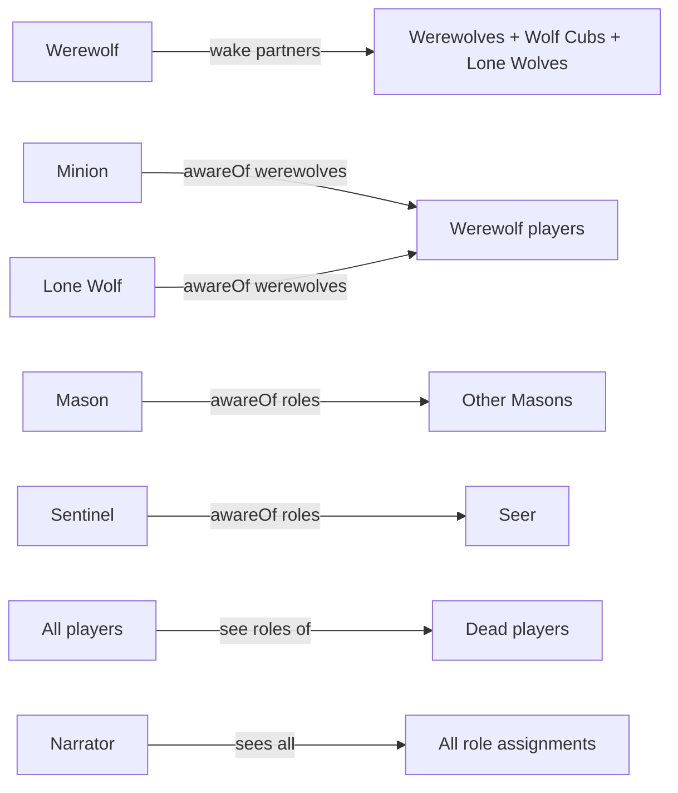
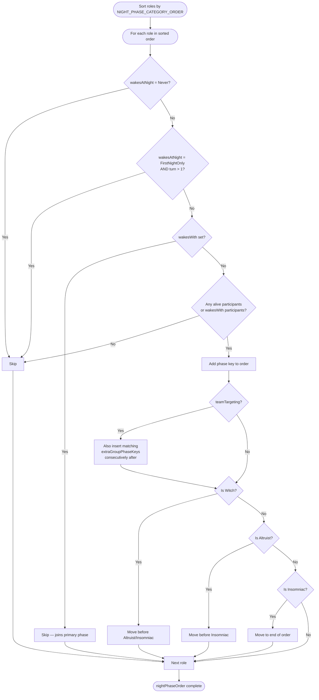

# Werewolf — Roles

## Overview

Each player is secretly assigned one role. The Narrator has no role and runs the game.

## Role Table

| Role          | ID                       | Team    | Wakes at Night                          | Night Action           | Notes                                                                                                                                                                                                                                                                                                                                                                                    |
| ------------- | ------------------------ | ------- | --------------------------------------- | ---------------------- | ---------------------------------------------------------------------------------------------------------------------------------------------------------------------------------------------------------------------------------------------------------------------------------------------------------------------------------------------------------------------------------------- |
| Alpha Wolf    | `werewolf-alpha-wolf`    | Bad     | Every Night                             | Special (bite)         | Wakes with Werewolves (`wakesWith: Werewolf`, `isWerewolf`); once per game (`oncePerGame`), narrator uses `alpha-wolf-bite` to convert a living Good/Neutral player to Werewolf via `roleOverrides`. `unique`.                                                                                                                                                                           |
| Altruist      | `werewolf-altruist`      | Good    | Every Night (before Insomniac)          | Special (intercept)    | Acts after the Witch (second-to-last before Insomniac); intercepts an attack on the target and dies in their place                                                                                                                                                                                                                                                                       |
| Arsonist      | `werewolf-arsonist`      | Neutral | Every Night                             | Special (douse/ignite) | Targeting another player _douses_ them (persistent mark). Targeting self _ignites_ — all currently doused players are simultaneously attacked (protections apply individually); doused list resets after ignite. Wins as the last opposing threat. Seer reads "not a werewolf".                                                                                                          |
| Bodyguard     | `werewolf-bodyguard`     | Good    | Every Night                             | Protect                | Chosen target survives any attack that night; cannot protect the same player on consecutive nights (`preventRepeatTarget`)                                                                                                                                                                                                                                                               |
| Chupacabra    | `werewolf-chupacabra`    | Neutral | Every Night                             | Attack (conditional)   | Attack lands only if target is on Team Bad, **or** if all Team Bad players are already dead                                                                                                                                                                                                                                                                                              |
| Doctor        | `werewolf-doctor`        | Good    | Every Night                             | Protect                | Chosen target survives any attack that night; cannot protect self (`preventSelfTarget`)                                                                                                                                                                                                                                                                                                  |
| Dracula       | `werewolf-dracula`       | Neutral | Every Night                             | Special (claim wife)   | Claims one player as a wife each night (skip allowed). Wives retain original roles and are unaware. Wins if alive and ≥3 wives are simultaneously alive at night start (turn ≥ 2).                                                                                                                                                                                                       |
| Elusive Seer  | `werewolf-elusive-seer`  | Good    | First Night Only                        | —                      | Sees all Villager-role players on the first night                                                                                                                                                                                                                                                                                                                                        |
| Executioner   | `werewolf-executioner`   | Neutral | Never                                   | —                      | Assigned a random Good-team target. Wins if that target is voted out at trial                                                                                                                                                                                                                                                                                                            |
| Exposer       | `werewolf-exposer`       | Good    | Every Night                             | Special (reveal)       | Reveals target's role publicly; one-time ability (`oncePerGame`)                                                                                                                                                                                                                                                                                                                         |
| Ghost         | `werewolf-ghost`         | Good    | Never                                   | —                      | After dying, observes all nighttime activity at narrator level; once per day phase may leave a short clue (≤ 20 characters) visible to all living players                                                                                                                                                                                                                                |
| Hunter        | `werewolf-hunter`        | Good    | Never                                   | —                      | When killed (night or trial), triggers revenge — Narrator selects a target to kill. Revenge kill is unblockable. Win condition deferred until revenge resolved.                                                                                                                                                                                                                          |
| Illuminati    | `werewolf-illuminati`    | Neutral | First Night Only                        | —                      | On night 1, Narrator reveals all players' roles to the Illuminati. Wins if alive in the final 3 players when the game ends (`revealsFullRoleList`)                                                                                                                                                                                                                                       |
| Insomniac     | `werewolf-insomniac`     | Good    | Every Night (last)                      | —                      | Wakes after all other roles (including Altruist); learns whether each immediate neighbor (by `playerOrder`) woke and performed a night action this night. `unique`.                                                                                                                                                                                                                      |
| Lone Wolf     | `werewolf-lone-wolf`     | Neutral | Every Night                             | — (wakes with wolves)  | `isWerewolf`; `wakesWith: Werewolf`. Werewolves don't know the Lone Wolf's identity. Wins only if they are the last wolf-aligned player alive                                                                                                                                                                                                                                            |
| Martyr        | `werewolf-martyr`        | Good    | Never                                   | —                      | Once per game, after a Guilty verdict and before the role reveal, may step forward to be eliminated in place of the convicted player. Cannot save themselves. (`unique`)                                                                                                                                                                                                                 |
| Mason         | `werewolf-mason`         | Good    | First Night Only                        | —                      | Masons see each other's identities (`awareOf: Masons`); no action after night 1. **Must always be added in pairs** — exactly 1 Mason is invalid and rejected by `validateRoleConfig`                                                                                                                                                                                                     |
| Mayor         | `werewolf-mayor`         | Good    | Never                                   | —                      | Vote counts double during trials (secret — not revealed to other players)                                                                                                                                                                                                                                                                                                                |
| Mentalist     | `werewolf-mentalist`     | Good    | Every Night                             | Investigate (dual)     | Selects two players and learns whether they are on the same team (`dualTargetInvestigate`)                                                                                                                                                                                                                                                                                               |
| Mercenary     | `werewolf-mercenary`     | Neutral | Every Night                             | Special (dual mode)    | Starts in Protect mode. When protection blocks an attack, earns a coin and switches to Bribe mode. In Bribe mode, spends the coin to bribe one player — tying the Mercenary's win condition to that player's team. Bribed player is unaware. `preventSelfTarget`.                                                                                                                        |
| Minion        | `werewolf-minion`        | Bad     | First Night Only                        | —                      | Sees all werewolf players (`awareOf: werewolves`); werewolves do not know the Minion's identity                                                                                                                                                                                                                                                                                          |
| Mirrorcaster  | `werewolf-mirrorcaster`  | Good    | Every Night                             | Special (dual mode)    | Starts in Protect mode. When protection blocks an attack, gains a charge and switches to Attack mode. Attack is standard (blockable). Charge persists until used. `preventSelfTarget`.                                                                                                                                                                                                   |
| Monarch       | `werewolf-monarch`       | Good    | Every Night                             | Special (knight)       | Knights one player per night (max 3 per game). Knighted players are public and get +1 trial vote while alive. Monarch is night-protected while any Knighted player is alive (with role-specific exceptions).                                                                                                                                                                             |
| Mortician     | `werewolf-mortician`     | Good    | Every Night                             | Attack                 | Attacks each night until they kill a Werewolf, then ability ends. If target is protected, receives "not a Werewolf" regardless of actual role. `preventSelfTarget`.                                                                                                                                                                                                                      |
| Mummy         | `werewolf-mummy`         | Good    | Every Night                             | Special (hypnotize)    | Hypnotizes target's vote the following day — their vote mirrors the Mummy's vote                                                                                                                                                                                                                                                                                                         |
| Mystic Seer   | `werewolf-mystic-seer`   | Good    | Every Night                             | Investigate            | Learns the target's exact role, not just their team (`revealsExactRole`)                                                                                                                                                                                                                                                                                                                 |
| Old Man       | `werewolf-old-man`       | Good    | Never                                   | —                      | Dies peacefully after (#werewolves + 2) nights via a timer. No special protection — wolves kill normally. Peaceful death only if the timer is the sole cause (not attacked same night).                                                                                                                                                                                                  |
| One-Eyed Seer | `werewolf-one-eyed-seer` | Good    | Every Night                             | Investigate            | Learns whether target is on Team Bad; if a werewolf is detected, locks onto that player for future nights                                                                                                                                                                                                                                                                                |
| Pacifist      | `werewolf-pacifist`      | Good    | Never                                   | —                      | Vote is forced to innocent during trials (`alwaysVotesInnocent`)                                                                                                                                                                                                                                                                                                                         |
| Priest        | `werewolf-priest`        | Good    | Every Night                             | Protect                | Places a persistent ward on the target; ward absorbs the next attack on that player                                                                                                                                                                                                                                                                                                      |
| Seer          | `werewolf-seer`          | Good    | Every Night                             | Investigate            | Learns whether the target is on Team Bad; Narrator reveals result                                                                                                                                                                                                                                                                                                                        |
| Sentinel      | `werewolf-sentinel`      | Good    | First Night Only                        | —                      | Knows who the Seer is (`awareOf: Seer`); no action after night 1. Protects the Seer through daytime discussion.                                                                                                                                                                                                                                                                          |
| Spellcaster   | `werewolf-spellcaster`   | Good    | Every Night                             | Special (silence)      | Target is silenced the following day; cannot silence the same player on consecutive nights (`preventRepeatTarget`)                                                                                                                                                                                                                                                                       |
| Spoiler       | `werewolf-spoiler`       | Neutral | Never                                   | —                      | Wins instead of the winning team if alive when game ends                                                                                                                                                                                                                                                                                                                                 |
| Swapper       | `werewolf-swapper`       | Good    | Every Night                             | Special (swap)         | Selects two players; at end of night their final effects (attack, protection, silence, hypnosis) are swapped. Investigations unaffected. `dualTargetSwap`.                                                                                                                                                                                                                               |
| Tanner        | `werewolf-tanner`        | Neutral | Never                                   | —                      | Wins if killed (by wolves or trial). Death triggers immediate game end                                                                                                                                                                                                                                                                                                                   |
| Tavern Keeper | `werewolf-tavern-keeper` | Good    | Every Night                             | Special (hangover)     | Wakes at their normal position in the night order; chooses one player (including themselves) to serve too many drinks. At day start, that player's night action is retroactively undone as if they never acted — they appear in the Night Summary as "awakes with a hangover". Investigative roles are unaffected. Hangover is suppressed if the target was killed that night. `unique`. |
| The Count     | `werewolf-count`         | Good    | First Night Only                        | —                      | Learns the number of werewolf-aligned players in the left half vs. right half of the seating order (`playerOrder`). No night action on subsequent nights. `unique`.                                                                                                                                                                                                                      |
| The Thing     | `werewolf-the-thing`     | Good    | After First Night                       | Special (tap)          | Starting on night 2, selects one immediate neighbor (by `playerOrder`, narrator excluded) to tap; the tapped player learns they were touched but not by whom. Restricted to adjacent seats (`adjacentTargetOnly`). `unique`.                                                                                                                                                             |
| Tough Guy     | `werewolf-tough-guy`     | Good    | Never                                   | —                      | Survives the first attack; dies to a subsequent attack                                                                                                                                                                                                                                                                                                                                   |
| Veteran       | `werewolf-veteran`       | Good    | Every Night                             | None (self-alert)      | Each night may go on Alert (max 3 times). While Alerted: repels any wolf attack (one wolf dies), and counter-kills any solo player who physically visits them (Protect/Attack category roles, Mirrorcaster, and uncharged Mercenary in Protect mode). Charged Mercenary, Investigation roles, and other Special roles are exempt. Priest wards do not trigger the counter-kill.          |
| Vigilante     | `werewolf-vigilante`     | Good    | After First Night                       | Attack                 | Kills one player per night starting night 2. If target is Good-team and dies, Vigilante also dies. `preventSelfTarget`.                                                                                                                                                                                                                                                                  |
| Village Drunk | `werewolf-village-drunk` | Good    | Never                                   | —                      | Mute until sober. At start of night 3, a `roleOverrides` entry converts them to `villageDrunkSoberRoleId` (configured before game start). `unique`.                                                                                                                                                                                                                                      |
| Village Idiot | `werewolf-village-idiot` | Good    | Never                                   | —                      | Vote is forced to guilty during trials (`alwaysVotesGuilty`)                                                                                                                                                                                                                                                                                                                             |
| Villager      | `werewolf-villager`      | Good    | Never                                   | —                      | Baseline good-team role                                                                                                                                                                                                                                                                                                                                                                  |
| Werewolf      | `werewolf-werewolf`      | Bad     | Every Night                             | Attack (group vote)    | Sees wake-phase partners (other Werewolves, Wolf Cubs, Lone Wolves); `teamTargeting`, `isWerewolf`                                                                                                                                                                                                                                                                                       |
| Witch         | `werewolf-witch`         | Good    | Every Night (before Altruist/Insomniac) | Special (once)         | After all other roles act (except Altruist), may protect the attacked player **or** attack any other player; one-time ability                                                                                                                                                                                                                                                            |
| Wizard        | `werewolf-wizard`        | Bad     | Every Night                             | Investigate            | Checks whether the target is the Seer (`checksForSeer`)                                                                                                                                                                                                                                                                                                                                  |
| Wolf Cub      | `werewolf-wolf-cub`      | Bad     | Every Night                             | Attack (group vote)    | Wakes with Werewolves (`wakesWith`); when killed, Werewolves receive two attack phases the following night; `isWerewolf`                                                                                                                                                                                                                                                                 |
| Zombie        | `werewolf-zombie`        | Neutral | Every Night                             | Special (infect)       | Infects one player per night; infected players continue normally under their original roles. Wins when living infected outnumber living healthy players (Zombie excluded from count).                                                                                                                                                                                                    |

## Role Properties

```typescript
interface WerewolfRoleDefinition {
  id: WerewolfRole;
  name: string;
  team: Team; // Good | Bad | Neutral
  wakesAtNight: WakesAtNight; // Never | FirstNightOnly | AfterFirstNight | EveryNight
  targetCategory: TargetCategory; // None | Attack | Protect | Investigate | Special
  category?: string; // Display category for role selection UI
  awareOf?: { teams?: Team[]; roles?: WerewolfRole[]; werewolves?: boolean }; // Players this role can see
  teamTargeting?: boolean; // True = primary role for a group phase (Werewolves vote together)
  preventRepeatTarget?: boolean; // True = cannot target the same player on consecutive nights (Bodyguard, Spellcaster)
  preventSelfTarget?: boolean; // True = cannot target self (Doctor)
  wakesWith?: WerewolfRole; // Secondary role that silently joins the referenced role's group phase
  isWerewolf?: boolean; // True = counts as a werewolf for investigation and win-condition purposes (Werewolf, Wolf Cub)
  alwaysVotesGuilty?: boolean; // True = vote is forced to guilty during trials (Village Idiot)
  alwaysVotesInnocent?: boolean; // True = vote is forced to innocent during trials (Pacifist)
  checksForSeer?: boolean; // True = investigates whether target is the Seer (Wizard)
  revealsExactRole?: boolean; // True = investigation reveals the exact role, not just team (Mystic Seer)
  dualTargetInvestigate?: boolean; // True = selects two targets and learns if they share a team (Mentalist)
  dualTargetSwap?: boolean; // True = selects two targets and swaps their final night effects (Swapper)
  oncePerGame?: boolean; // True = ability can only be used once (Exposer)
  revealsFullRoleList?: boolean; // True = on night 1 narrator reveals all role assignments to this player (Illuminati)
}
```

## Night Phase Ordering

Roles wake in a consistent order determined by their `category`, following the rule **Bad team → Neutral team → Good team**, and within each team **Attack → Investigate → Protect → Special**. The full category order used for night phases is:

1. `EvilKilling` (Bad — Attack):
   - Werewolf (group phase, always first; includes Wolf Cub)
2. `EvilSupport` (Bad — Support/Investigate):
   - Minion (night 1 only)
   - Wizard
3. `NeutralKilling` (Neutral — Attack):
   - Chupacabra
   - Lone Wolf
   - Zombie
4. `NeutralManipulation` (Neutral — Special):
   - Dracula
5. `VillagerKilling` (Good — Attack):
   - Mortician
   - Vigilante
6. `VillagerInvestigation` (Good — Investigate):
   - Elusive Seer
   - Exposer
   - Mentalist
   - Mystic Seer
   - One-Eyed Seer
   - Seer
7. `VillagerProtection` (Good — Protect):
   - Bodyguard
   - Doctor
   - Mirrorcaster
   - Priest
   - Veteran
8. `VillagerSupport` (Good — Special):
   - Mason
   - Monarch
   - Mummy
   - Sentinel
   - Spellcaster
   - Tavern Keeper
9. `VillagerHandicap` (Good — no night action).

Within a category, the order is arbitrary. After all category-ordered roles, the Witch acts before the Altruist, and the Insomniac acts last.

Additional rules applied before the ordering:

1. Roles with `wakesAtNight: Never` are always skipped.
2. Roles with `wakesAtNight: FirstNightOnly` are skipped on turn 2+.
3. A role is skipped if all players assigned to it are dead.
4. Roles with `wakesWith` do not get their own phase — they participate in the primary role's phase.
5. The Witch acts after category-ordered roles and before the Altruist/Insomniac, so she can see current attacks before deciding.
6. The Altruist always acts after the Witch and before the Insomniac, so it can intercept attacks (including Witch attacks) on its target.
7. The Insomniac always acts last.
8. Extra group phases (e.g. Wolf Cub bonus attack) are inserted **immediately after** their corresponding base group phase, keeping both Werewolf phases consecutive.

## Default Role Distribution

The Narrator does not receive a role. For `n` total players:

| Role     | Count         |
| -------- | ------------- |
| Werewolf | `⌊(n−1) / 3⌋` |
| Seer     | 1             |
| Villager | remaining     |

Additional roles (Bodyguard, Witch, etc.) are configured per game in the lobby.

## Visibility Rules

Visibility is determined by two mechanisms:

1. **Wake-phase partners** (`teamTargeting` / `wakesWith`): Roles that share a group night phase see each other's identities. This is how Werewolves, Wolf Cubs, and Lone Wolves know each other — they wake together, not because of team membership.
2. **Aware-of** (`awareOf`): Explicit one-directional awareness of specific teams, roles, or werewolf-flagged players.

| Role      | Sees                                     | Mechanism                                                                    |
| --------- | ---------------------------------------- | ---------------------------------------------------------------------------- |
| Lone Wolf | All Werewolf wake-phase participants     | `wakesWith: Werewolf`, `awareOf: { werewolves: true }`                       |
| Mason     | Other Masons                             | `awareOf: { roles: [Mason] }`                                                |
| Minion    | All `isWerewolf` players                 | `awareOf: { werewolves: true }` (one-directional — wolves do NOT see Minion) |
| Sentinel  | The Seer                                 | `awareOf: { roles: [Seer] }`                                                 |
| Werewolf  | Other Werewolves, Wolf Cubs, Lone Wolves | Wake-phase partners (`teamTargeting`)                                        |
| Wolf Cub  | All Werewolf wake-phase participants     | `wakesWith: Werewolf`                                                        |
| Dead      | Roles revealed to all players            | Controlled by lobby setting (default: on)                                    |
| Narrator  | All role assignments                     | Always                                                                       |

Note: Werewolves do **not** see the Minion or Wizard. Those roles are Team Bad but have no wake-phase connection to the Werewolf group.



## Night Phase Ordering Logic


