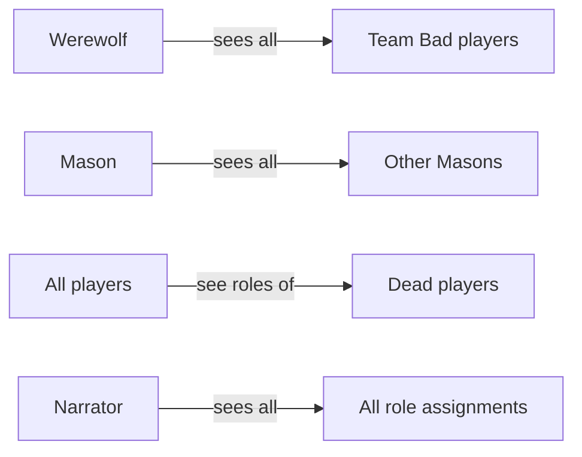
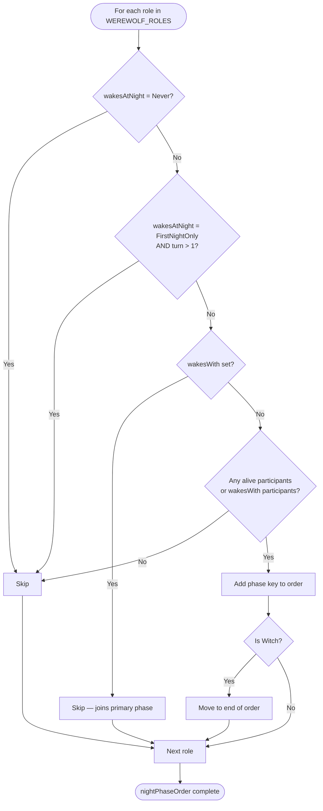

# Werewolf — Roles

## Overview

Each player is secretly assigned one role. The Narrator has no role and runs the game.

## Role Table

| Role          | ID                       | Team    | Wakes at Night     | Night Action         | Notes                                                                                                       |
| ------------- | ------------------------ | ------- | ------------------ | -------------------- | ----------------------------------------------------------------------------------------------------------- |
| Villager      | `werewolf-villager`      | Good    | Never              | —                    | Baseline good-team role                                                                                     |
| Werewolf      | `werewolf-werewolf`      | Bad     | Every Night        | Attack (group vote)  | Sees all Bad-team players; votes jointly with other Werewolves and Wolf Cubs                                |
| Wolf Cub      | `werewolf-wolf-cub`      | Bad     | Every Night        | Attack (group vote)  | Wakes with Werewolves (`wakesWith`); when killed, Werewolves receive two attack phases the following night  |
| Seer          | `werewolf-seer`          | Good    | Every Night        | Investigate          | Learns whether the target is on Team Bad; Narrator reveals result                                           |
| Bodyguard     | `werewolf-bodyguard`     | Good    | Every Night        | Protect              | Chosen target survives any attack that night; cannot protect the same player on consecutive nights          |
| Witch         | `werewolf-witch`         | Good    | Every Night (last) | Special (once)       | After all other roles act, may protect the attacked player **or** attack any other player; one-time ability |
| Spellcaster   | `werewolf-spellcaster`   | Good    | Every Night        | Silence              | Target is silenced the following day; cannot silence the same player on consecutive nights                  |
| Mason         | `werewolf-mason`         | Good    | First Night Only   | —                    | Masons see each other's identities; no action after night 1                                                 |
| Chupacabra    | `werewolf-chupacabra`    | Neutral | Every Night        | Attack (conditional) | Attack lands only if target is on Team Bad, **or** if all Team Bad players are already dead                 |
| Village Idiot | `werewolf-village-idiot` | Good    | Never              | —                    | Baseline good-team role                                                                                     |

## Role Properties

```typescript
interface WerewolfRoleDefinition {
  id: WerewolfRole;
  name: string;
  team: Team; // Good | Bad | Neutral
  wakesAtNight: WakesAtNight; // Never | FirstNightOnly | EveryNight
  targetCategory: TargetCategory; // None | Attack | Protect | Investigate | Special
  canSeeTeam?: Team[]; // Teams whose members this role can see
  canSeeRole?: WerewolfRole[]; // Specific roles this role can identify
  teamTargeting?: boolean; // True = primary role for a group phase (Werewolves vote together)
  preventRepeatTarget?: boolean; // True = cannot target the same player on consecutive nights (Bodyguard, Spellcaster)
  wakesWith?: WerewolfRole; // Secondary role that silently joins the referenced role's group phase
}
```

## Night Phase Ordering

Roles wake in the order they are defined in `WEREWOLF_ROLES`, subject to these rules:

1. Roles with `wakesAtNight: Never` are always skipped.
2. Roles with `wakesAtNight: FirstNightOnly` are skipped on turn 2+.
3. A role is skipped if all players assigned to it are dead.
4. Roles with `wakesWith` do not get their own phase — they participate in the primary role's phase.
5. The Witch always acts **last**, after all other roles, so she can see current attacks before deciding.

## Default Role Distribution

The Narrator does not receive a role. For `n` total players:

| Role     | Count         |
| -------- | ------------- |
| Werewolf | `⌊(n−1) / 3⌋` |
| Seer     | 1             |
| Villager | remaining     |

Additional roles (Bodyguard, Witch, etc.) are configured per game in the lobby.

## Visibility Rules

- **Werewolves** see all other Team Bad players (`canSeeTeam: [Team.Bad]`), including Wolf Cubs.
- **Wolf Cubs** see all other Team Bad players (`canSeeTeam: [Team.Bad]`), including Werewolves.
- **Masons** see all other Masons (`canSeeRole: [Mason]`).
- **Dead players** have their roles revealed to all living players automatically.
- All other roles see only their own identity.



## Night Phase Ordering Logic


